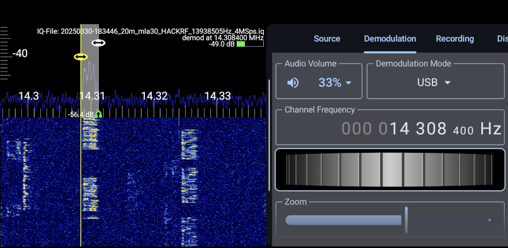

# RF Analyzer for Android

**RF Analyzer** is an Android app for real-time spectrum analysis using SDR
hardware such as HackRF and RTL-SDR. It displays live **FFT and waterfall
plots** of the radio frequency (RF) spectrum and supports **demodulation**,
**recording**, and more.

Whether you're a radio hobbyist, ham operator, or just curious about what's
flying through the airwaves, RF Analyzer makes exploring the RF world from your
phone both practical and fun.

---

## Features

- Real-time **FFT and waterfall display** with scroll and pinch-to-zoom
- Supports **HackRF**, **RTL-SDR**, and **File Source** (files with raw IQ
  data)
- Audio demodulation: **CW**, **AM**, **nFM**, **wFM**, **LSB**, **USB**
- Record raw IQ data
- Modern and dynamic UI with a bottom (or side) drawer for full control
- Adjustable Settings such as averaging, peak hold, FFT size, color maps, color
  theme, screen orientation and more
- Documentation (user manual) and context-aware help system in the app

---

## Supported Devices

- HackRF (via [hackrf_android](https://github.com/demantz/hackrf_android))
- RTL-SDR dongles (via [rtl-sdr driver](http://sdr.osmocom.org/trac/wiki/rtl-sdr))
- Airspy (via [libairspy](https://github.com/airspy/airspyone_host/tree/master/libairspy))
- HydraSDR (via [libhydrasdr](https://github.com/hydrasdr/rfone_host/tree/main/libhydrasdr))
- File input (from previously recorded IQ files or external sources)

> *Note*: Proper USB OTG support and a reliable cable/hub may be necessary for some setups.

---

## Manual

**Video Tutorial:**

  

A full **user manual** is available in the `docs/` folder and online via MkDocs:

[**Read the RF Analyzer Manual**](https://demantz.github.io/RFAnalyzer/)

Topics include:

- Quick Start & Setup
- User Interface & Controls
- SDR & FFT Configuration
- Demodulation Modes
- Signal Identification Tips
- Recording & Playback
- Advanced SDR Topics (dB, FFT theory, ham radio...)

---

## Download & Support

Get RF Analyzer on **Google Play**:

The app is available as a **free trial**, giving you 7 days of usage after
installation and up to 60 minutes of operation time. This allows you to fully
explore the features and see if it fits your needs and works with your
hardware.

If you enjoy using the app, you can unlock the full version via a **one-time
in-app purchase**.

RF Analyzer is a passion project developed in my spare time. A lot of
effort has gone into making it useful, reliable, and fun to use. Supporting
the app through the in-app purchase not only removes the trial limitations -
it also helps me keep improving and maintaining the project. Thank you! 🙏

You can also donate to support my work:

---

## About the Author

Hello, my name is Dennis Mantz and I greet you from Heidelberg in Germany! How
to reach me:

- Callsign: DM4NTZ
- Mastodon: [@dm4ntz@chaos.social](https://chaos.social/@dm4ntz)
- Mail: rfanalyzerapp -at- gmail -dot- com

## Acknowledgments

I'd like to thank some people for their support and contributions
during the development of RF Analyzer:

- My partner **Anja**, who helped me a lot during the development of the new UI
  (she's the reason this app finally has a clean UX and looks so polished!)
- All **Testers on Reddit** who joined the beta test and reported issues
- **Michael Ossmann** and the team around the HackRF which initially inspired
  me to start this app years ago
- **Martin Marinov**, the developer of the RTL-SDR Android driver
- **Everyone who shared positive feedback** - your encouragement means a lot
  and motivates me to keep improving the app!

## License

This software is free software; you can redistribute it and/or
modify it under the terms of the GNU General Public
License as published by the Free Software Foundation; either
version 2 of the License, or (at your option) any later version.
[http://www.gnu.org/licenses/gpl.html](http://www.gnu.org/licenses/gpl.html) GPL version 2 or higher

Principal Author: Dennis Mantz

The following assets are NOT covered by the GPL and remain the exclusive
property of the original author:

- Application name
- Logo and app icon
- Any other branding elements (including but not limited to promotional images
  and screenshots)

You may not use the original name, logo, or other branding elements of this
project in modified versions of the app without prior written permission from
the copyright holder.

For more license information see the about section inside the app or in the
user manual.

